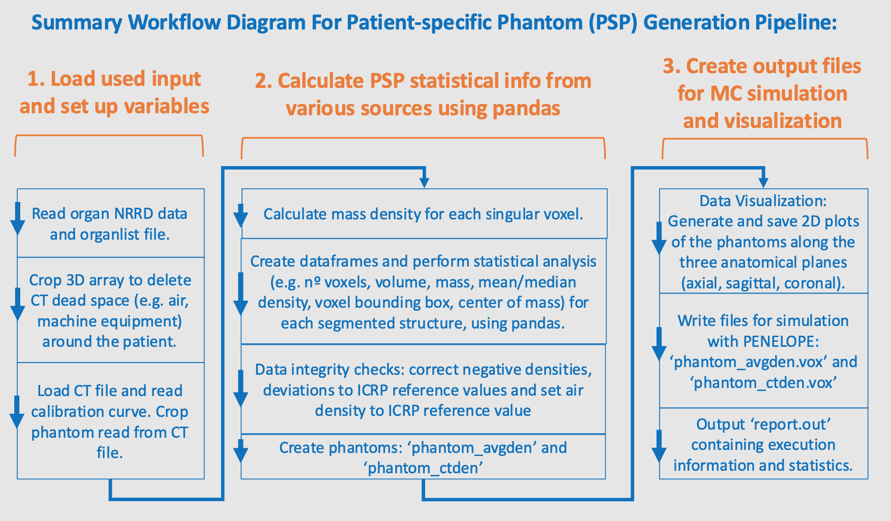

# Pipeline for generation of Patient-specific Voxel Phantom
A Python pipeline for the analysis of segmented medical images (`.nrrd` labelmaps). This pipeline performs statistical analysis, generates 2D slice visualizations, and converts the data into patient-specific voxel phantoms (`.vox` files) compatible with the PENELOPE/penEasy Monte Carlo (MC) simulation framework.

## Introduction
In medical physics and radiation dosimetry, accurate modeling of patient anatomy is crucial for computational radiation dosimetry employing MC simulations. This pipeline addresses the need for a streamlined, automated tool to convert segmented 3D medical images (in NRRD format) into patient-specific computational phantoms.

It processes a labelmap file where each integer value corresponds to a specific organ or tissue, alongside an organ list and an optional CT scan. The primary output is a `.vox` file, ready for use in advanced dosimetry simulations with PENELOPE/penEasy, along with a comprehensive report and slice-by-slice visualizations.

This tool is designed for medical physicists, researchers, and students working with computational dosimetry and medical imaging.


## Description

The key features of the pipeline are:

1. __NRRD Processing__: Loads segmented phantom labelmaps and optional CT data from `.nrrd` files. Although medical images may be segmented using a variety of open source and proprietary software, for this pipeline, [3D slicer](https://www.slicer.org/) was employed to segment the CT images and create a NRRD segmented labelmap.
2. __Automatic Cropping__: Automatically removes empty space (e.g. air, CT equipment, other foreign objects) around the phantom to optimize phantom size and simulation speed.
3. __CT Data Integration__: Converts Hounsfield Units (HU) from a CT scan into mass density (g/cm³) using a user-provided CT calibration curve.
4. __Statistical Analysis__: Calculates key statistics for each organ, including volume, mass, mean/median density, Voxel Bounding Box (VBB), and Center of Mass (COM), in accordance with the International Commission on Radiation Protection (ICRP) standard format.
5. __Data Integrity Checks__: Includes several safeguards:
    * Corrects negative densities that may arise from CT conversion.
    * Replaces densities of organs with large deviations to ICRP reference values, preventing unrealistic data.
    * Ensures consistency by setting air densities to ICRP reference values.
6. __Phantom Generation__: The pipeline creates two voxel phantoms:
    *  `phantom_avgden.vox`: A phantom where all voxels of an organ are assigned the organ's average density.
    *  `phantom_ctden.vox`: A more detailed phantom where each voxel has a specific density derived from the CT scan (if provided).
7. __Data Visualization__: Generates and saves 2D slice images of the phantom along all three anatomical planes (axial, sagittal, coronal) for visual verification.
8. __Comprehensive Reporting___: Outputs a detailed `report.out` file containing detailed information and all calculated statistics in well-formatted tables.




## Prerequisites

To run this pipeline, you'll need Python 3.x, as well as the following libraries, which are included with the anaconda distribution, except for pynrrd.
- numpy, pandas, matplotlib, tabulate, time, [pynrrd](https://github.com/mhe/pynrrd)

You can also install the dependencies using pip, via the terminal command:

```
pip install numpy pandas tabulate matplotlib scipy pynrrd
```

And use analogous commands for the other libraries.

It's possible to install pynrrd using anaconda, via the following terminal commands:

```
conda install conda-forge::pynrrd
```


## Execution

1.  Open a terminal/command prompt and navigate to the script's directory.
2.  Run the script using Python:
    ```
    python pipeline_patient_specific_phantom_generation.py
    ```
3.  The script will then guide you through a highly user-friendly and configurable through the command-line interface, consisting of a series of interactive prompts:
    * Provide the paths to your input files. You can press Enter (leaving the path blank) to accept the defaults. You can also change the default file paths by changing the constants at the beggining of the script file.
    * Indicate whether you have a corresponding CT file (`y/n`).
    * If using a CT file, you must also have your scanner's calibration curve (`HU = a * Density - b`) data. Enter the slope, a, and intercept, b.
    * Indicate if you want to generate and save the 2D slice visualizations and provide a destination folder. This step may take some time, depending on the size of your phantom, because all 2D plots are generated and saved for the axial, sagittal and coronal planes.
    * Indicate if you want to create the final `.vox` files for simulation with the PENELOPE MC framework.

__Note:__ During execution of the program, the execution time is prompted various times throughout the program, so the user can understand which steps of processing take more or less time.


## Usage & Configuration

The pipeline is designed to be run interactively from the command line.

### Input Files
The user should place the following input files in the same directory as the script, or provide their full paths when prompted.

* __Segmented Phantom Labelmap (`.nrrd`)__
    * A 3D NRRD file where each voxel has an integer value corresponding to an `Organ_ID`.
    * The is a variety of open surce and proprietary software for segmentation of medical images and generation of labelmaps in `.nrrd` format. The authors recommend the open source software [3D slicer](https://www.slicer.org/), particularly to new users, because it is powerful, user friendly and easy to use. However, many other softwares may be employed for this purpose, e.g. Image-J, ITK-Snap, MD.ai.
    * Default name: `phantom_labelmap.nrrd`
 
Axial slice of an example `.nrrd` segmented phantom labelmap.


* __Organlist (`.csv`)__
    * A CSV file that maps each organ/structure segmented (i.e `Organ_ID`) to its properties.
    * An example organlist file is provided with the script.
    * This file __must contain__ the following columns: `Organ_ID`, `Organ`, `Material_ID`, `Material`, `Density_ICRP`.
    * `Organ_ID` and `Material_ID` are integers unequivocally indentifying each organ and material, respectivelly, in `phantom_labelmap.nrrd`. As a convention, Organ_ID = 0 is air outside phantom and Organ_ID = maximum is air inside phantom.
    * `Organ` and `Material` are strings identifying unequivically each Organ_ID and Material_ID. It is strongly advised to not use spaces in Organ and Material names. E.g., instead of "right lung", use "right_lung" or "rightLung".
    * Two Organ_IDs may correspond to the same Material_ID, but one Organ_ID may only correspond to one Material ID. E.g., the Organs "left_lung" and "right_lung" both correspond to the Material "lung", but the Organ "left_lung" only belongs to the Material "lung".
    * The the number of Material_IDs and association to Organ_IDs is depedent on user needs and application of this pipeline. On the one hand, if you associate a different Material_ID to each Organ_ID, visualization and simulation results will be more deatiled, but more computationally demanding. On the other hand, if you associate several Organ_IDs to the same Material ID, visualization and simulation will be less computationally demanding, but the results will be less detailed. Therefore, the composition of the organlist file is essential for obtaining proper and successfull results with this pipeline and is always depedent on the purpose of the user.
    * `Density_ICRP` corresponds to the reference density to be used for an organ/tissue/material, as defined by ICRP or other international commission/association.
    * Default name: `organlist.csv`


* __CT File (`.nrrd`)__
    * A 3D NRRD file containing the raw CT data in Hounsfield Units (HU). This file must be spatially registered with the phantom labelmap.
    * This is an optional file. If provided, the script will generate a more accurate, voxel-specific density map.
    * If not provided, the script will use the `Density_ICRP` reference values from `organlist.csv`. 
    * Default name: `ct.nrrd`

### Output Files
If a CT file and calibration curve are provided, `phantom_avgden.vox` and `phantom_ctden.vox` are created using personalized voxel densities calculated from the CT image. If no CT file/calibration curve are provided, reference density values from the ICRP (in `organlist.csv`) are used and only 'phantom_avgden.vox' will be generated. Furthermore, all the relevant statistics are calculated based on the ICRP reference densities provided by the user. The pipeline generates the following files in the same directory:

* __`report.out`:__ A comprehensive text file with detailed explanations on program execution, tables for organ statistics, material properties, VBB, and COM. There are two output streams: terminal and file `report.out`. There is info that is outputted to both streams. However, while the file `report.out` is more for reporting results/calculations performed in the phantom, the terminal is more for reporting the progress of execution, if there are issues with data integrity, etc.
* __`phantom_avgden.vox`:__ The voxel phantom file ready for simulation with MC PENELOPE, using average organ densities. For each organ, the average density was calculated for all voxels comprising the organ. Then, the average density value was assigned to all voxels.
* __`phantom_ctden.vox`:__ (Optional) The voxel phantom file using singular per-voxel densities from the CT scan.
* __`phantom_plots/`:__ (Optional) A directory containing all the generated 2D slice visualizations, organized by phantom type and anatomical plane. The user can specify the path to save the 2D slice visualizations.

Example partial depiction of the file ´report.out´:


## Example

1.  Place `pipeline_patient_specific_phantom_generation.py`, `phantom.nrrd`, `organlist.csv`, and `ct.nrrd` in a folder.
2.  Open the terminal and run the script: `python pipeline_patient_specific_phantom_generation.py`
3.  At the prompts, press **Enter** to accept the default file names.
4.  When asked about the CT file, enter `y`.
5.  Enter the calibration parameters (e.g., slope `902.2`, intercept `906.48`).
6.  When asked to save plots, enter `y` and provide a path (e.g., `./`) or `n`. This may take some time.
7.  When asked to create `.vox` files, enter `y`.
8.  The script will execute the full pipeline and generate `report.out`, `phantom_avgden.vox`, `phantom_ctden.vox`, and a `phantom_plots` directory in your current folder.

Image depicting the program running on the terminal:


## Disclaimer

This software is provided "as is" for academic, scientific, and research purposes only. It is not a medical device, nor intended for clinical use, and has not been approved by any medical regulatory authority (e.g., EMA, FDA). The authors and contributors provide this software "as is", without any warranty of any kind, either expressed or implied. This includes, but is not limited to, the implied warranties of merchantability and fitness for a particular purpose. 

The users are solely responsible for data privacy management when using this program.
- Users must ensure they have the legal and ethical authority to use and process any patient data.
- Users must de-identify and anonymize all personal health information (PHI) in accordance with all applicable data protection laws and regulations (e.g., GDPR in Europe, HIPAA in the United States) before using it with this software.
- The authors of this software take no responsibility for data breaches or misuse of personal data by users of this script.

By using this software, you acknowledge that you have read, understood, and agree to be bound by the terms of this disclaimer.


## License

Copyright (C) 2025 Jorge Cebola Borbinha
This program is free software: you can redistribute it and/or modify it under the terms of the GNU Affero General Public License Version 3 (AGPLv3) as published by the Free Software Foundation.
See the GNU Affero General Public License for more details, available at: [AGPL v3 LICENSE](https://github.com/jorge-borbinha/Patient-specific_voxel_phantom_generation/blob/main/LICENSE.md)


## How to Contribute

Contributions are welcome! If you have suggestions for improvements or find a bug, please feel free to contact me.
